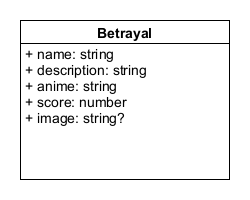

# Anime Betrayals

### Short description

A small website I made that helped me experiment with [ReactJS](https://reactjs.org/), [TypeScript](https://www.typescriptlang.org) and [Tailwind](https://tailwindcss.com/).

### Architecture

The website simply constitutes a SPA which allows the user to view and create *Betrayals*(more on that below). The app lives inside a ReactJS component called *Home* which is responsible for displaying a welcome screen. The *Home* component owns the *Content* components that can be view with the click of button. The main purpose of the *Content* component is to display all existing *Betrayals*. Furthermore, using the *Content*, the user can create more *Betrayals* with the help of a form.

### Betrayal

A *Betrayal* is a TypeScript type object that describes the betrayal of an anime character in a single anime series.

